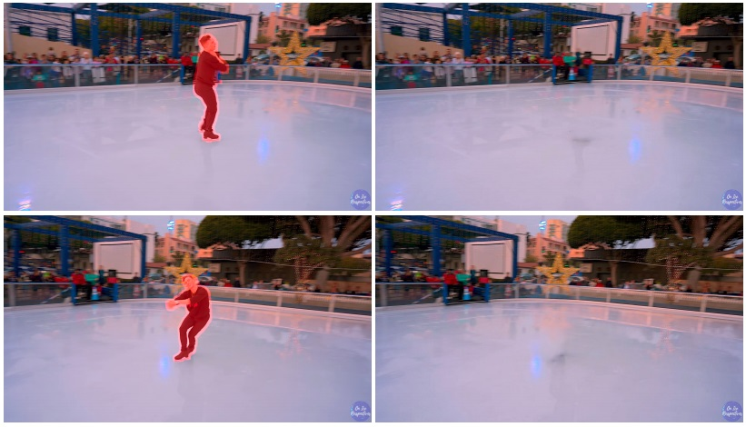
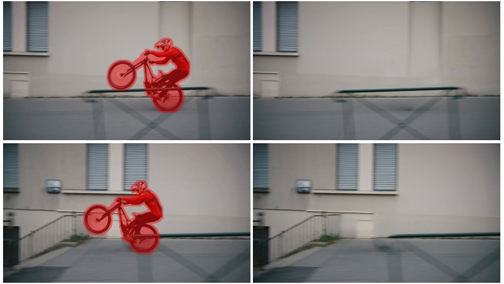

# Annotated 4K Videos 
[paper](https://arxiv.org/abs/2108.01912) | [project website](https://tengfei-wang.github.io/Implicit-Internal-Video-Inpainting/) | [code](https://github.com/Tengfei-Wang/Implicit-Internal-Video-Inpainting) | [demo video](https://youtu.be/VlDSJtmBqBs)

4K videos with annotated object masks in our ICCV2021 paper: Internal Video Inpainting by Implicit Long-range Propagation.   
We provide 5 video sequences with annotated object masks in this repo. The resolution is   3840 x 2160. 

     

## Download
Download the data [here](https://hkustconnect-my.sharepoint.com/:f:/g/personal/tfwang_connect_ust_hk/Ekm15tmu5ghNr77JL3jxjzoBxZMhXGz8_zndHSz_lBAvKg).
 

## Citation
If you find this work useful for your research, please cite:
``` 
@inproceedings{ouyang2021video,
  title={Internal Video Inpainting by Implicit Long-range Propagation},
  author={Ouyang, Hao and Wang, Tengfei and Chen, Qifeng},
  booktitle={International Conference on Computer Vision (ICCV) },
  year={2021}
} 
```

If you are also interested in the image inpainting or internal learning, [this paper](https://tengfei-wang.github.io/EII/index.html) can  be also helpful :)
```
@inproceedings{wang2021image,
  title={Image Inpainting with External-internal Learning and Monochromic Bottleneck},
  author={Wang, Tengfei and Ouyang, Hao and Chen, Qifeng},
  booktitle={Proceedings of the IEEE/CVF Conference on Computer Vision and Pattern Recognition},
  pages={5120--5129},
  year={2021}
}
```
